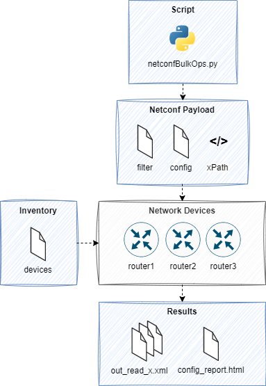

# netconfBulkOps

netconfBulkOps is a Python script for NETCONF bulk operations (get and edit-config) implemented as a minimum viable product (MVP).

A simple inventory file is used to describe the devices. A second file, containing either the NETCONF configuration payload or a subtree-filter, will then be applied to every device in the inventory. The results of the bulk operation is stored in corresponding files.



netconfBulkOps is executed asynchronously using Python's [concurrent.futures](https://python.readthedocs.io/en/stable/library/concurrent.futures.html) [ThreadPoolExecutor](https://python.readthedocs.io/en/stable/library/concurrent.futures.html#concurrent.futures.ThreadPoolExecutor) and is therefore pretty fast. 


## Installation and usage

### Python based installation

Clone the repo
```bash
git clone https://github.com/spie-ics-ag/netconfBulkOps.git
```
Go to your project folder
```bash
cd netconfBulkOps
```

Set up a Python venv

First make sure that you have Python 3 installed on your machine. We will then be using venv to create an isolated environment with only the necessary packages.

Install virtualenv via pip
```bash
pip install virtualenv
```

Create the venv
```bash
python3 -m venv .venv
```

Activate your venv
```bash
source .venv/bin/activate
```

Install dependencies
```bash
pip install -r requirements.txt
```

Configure the NETCONF username and password used to connect to your devices as environment variables
```bash
export NCBO_USER=your_username
export NCBO_PASSWORD=your_password
```


### Docker based installation

Clone the repo
```bash
git clone https://github.com/spie-ics-ag/netconfBulkOps.git
```
Go to your project folder
```bash
cd netconfBulkOps
```

Configure the NETCONF username and password used to connect to your devices as environment variables
```bash
export NCBO_USER=your_username
export NCBO_PASSWORD=your_password
```

Build the docker image
```bash
docker build -t ncbo .
```

Run and enter the container
```bash
docker run -it -e NCBO_USER -e NCBO_PASS ncbo sh
```

In order to copy your `[DEVICES]` and `[FILTER]/[CONFIG]` files (see usage below) to the container you may use the [docker cp](https://docs.docker.com/engine/reference/commandline/cp/) command.  

## Usage 


### Preparation

Create a inventory file with all devices you want to connect to. Every line in the file represents a hostname or IP address. 

**Example**
```
10.90.255.235
rtr01.internal.domain.com
sw01.internal.domain.com
10.90.255.245
```


### Read data (NETCONF get)

Create a file containing the subtree-filter you want to use (without the `<filter></filter>` tags).

**Example**
```xml
<native xmlns="http://cisco.com/ns/yang/Cisco-IOS-XE-native">
    <hostname/>
</native>
```

Start the script with the `netconfBulkOps.py read [FILTER] [DEVICES]` command. `FILTER` is your subtree-filter file and `DEVICES` is the inventory file. If you don't specify these parameters `bulk_filter.xml` is used as the default filter file and `devices.txt` is used as the default inventory file.

```bash
Usage: netconfBulkOps.py read [FILTER] [DEVICES]

  Retrive configuration and state information from all devices in the DEVICES
  file according the subtree filter in the FILTER file.
```

After the script is completed, you'll find a file per device containing the results in the `output` directory (`output/out_read_[DEVICE NAME OR IP].xml`). 


### Write data (NETCONF edit-config)

Create a file containing the configuration you want to apply (outermost tag must be `<config></config>`).

**Example**
```xml
<config>
  <native xmlns="http://cisco.com/ns/yang/Cisco-IOS-XE-native">
    <banner>
      <motd>
        <banner>Welcome to this device. Have a nice day!</banner>
      </motd>
    </banner>
  </native>
</config>
```

Start the script with the `netconfBulkOps.py write [CONFIG] [DEVICES]` command. `CONFIG` is the file containing the configuration and `DEVICES` is the inventory file. If you don't specify these parameters `bulk_config.xml` is used as the default config file and `devices.txt` is used as the default inventory file.

```bash
Usage: netconfBulkOps.py write [CONFIG] [DEVICES]

  Loads the configuration specified in the CONFIG file to the running
  datastore of all devices in the DEVICES file.
```

After the script is completed, a HTML report about the configuration results is generated. This report is available as `config_report.html` in the `output` directory.

**Example report**


### Sandboxes

You may test this script using the following DevNet sandboxes:

- [IOS XE on CSR Latest Code AlwaysOn](https://devnetsandbox.cisco.com/RM/Diagram/Index/7b4d4209-a17c-4bc3-9b38-f15184e53a94?diagramType=Topology)
- [IOS XE on CSR Recommended Code AlwaysOn](https://devnetsandbox.cisco.com/RM/Diagram/Index/27d9747a-db48-4565-8d44-df318fce37ad?diagramType=Topology)
